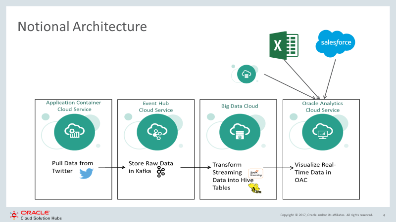

# Streaming-Analytics-Demo

Materials to integrate data from multiple sources (Excel, Kafka, Hive, DB) and visualize it in real time using Oracle Cloud. 

## About 

First, let's de-mystify a few acronyms; 

* ACCS - [Application Container Cloud Service](https://cloud.oracle.com/acc)
* OEH - [Oracle Event Hub](https://cloud.oracle.com/event-hub)
* BDC - [Big Data Cloud](https://cloud.oracle.com/en_US/big-data-cloud)
* OAC - [Oracle Analytics Cloud](https://cloud.oracle.com/en_US/oac)  

Now this picture should explain the rest: 

## Getting Started

To get started you should have an Oracle Cloud account with atleast 6 OCPUs.  
You should follow along in the [Technical Guide](static/Visualizing_Streaming_Data.docx)

Basically do this: 
1. Stand up Kafka, create a topic
2. Rename `template-config.py` to `config.py`, fill in config values, and deploy accs-tweet-producer to accs
3. Stand up BDC, rename `template-config.py` to `config.py`, fill in config values
4. Submit consumer spark job
5. Stand up DB & OAC
6. Connect OAC & BDC

## Thanks & Acknowledgements 

* https://gist.github.com/bonzanini/af0463b927433c73784d
* http://www.awesomestats.in/spark-twitter-stream/ 
* https://google.github.io/styleguide/pyguide.html 
