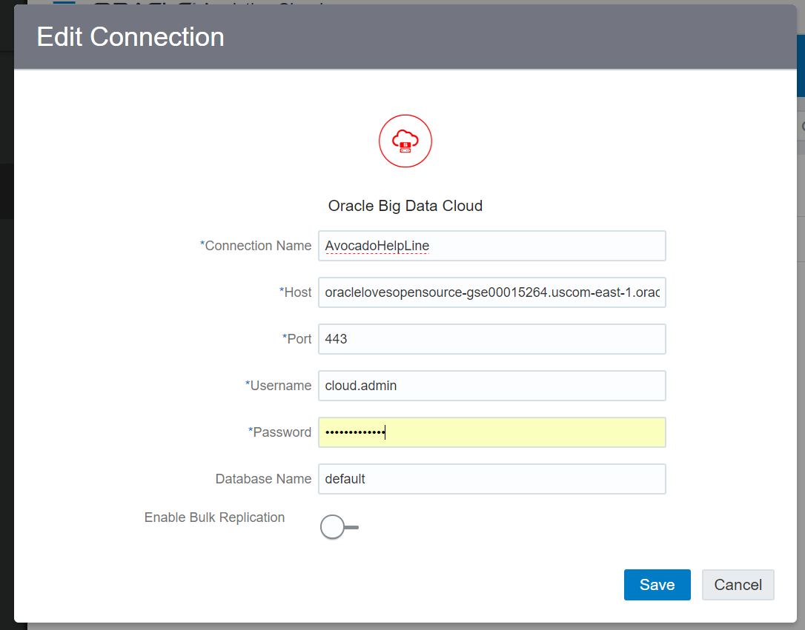
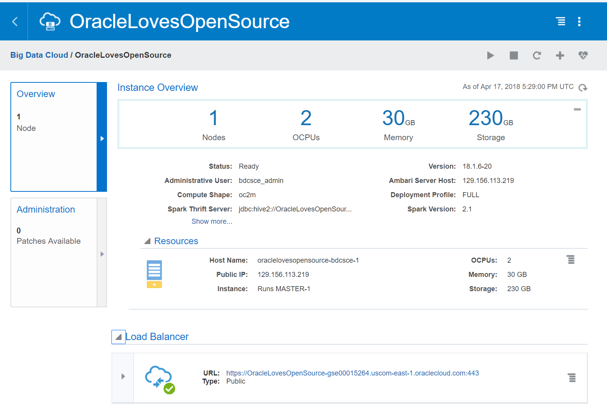

# OAC Bootstrap

You only really need this if your BDC instance doesn't have a valid certificate 
(if you choose to create it without IDCS the cert will be self-signed)

Otherwise just import the DVA file and set up the connection to BDC!

## Upload the `.dva` file
TODO:(sblack4)

## Connect BDC With IDCS
With IDCS enabled the connection is pretty simple...

* Enter a **Connection Name**
* For **Host** just enter the hostname of the load balancer for your BDC 
(notice that there's no `https://` at the begining or `:443` at the end)

* enter 443 for the **Port** 

* enter the **Username** and **Password** combo for your IDCS service (that you use to log into your cloud domain)

* you don't need a **Database Name** but by default the name is `default`

## Connect BDC Without IDCS 
TODO:(sblack4)
